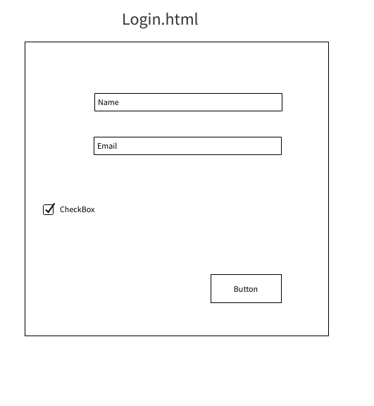
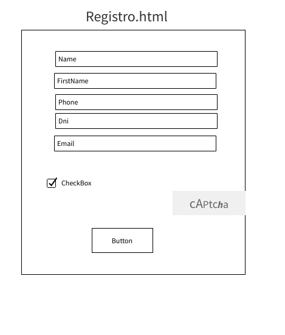
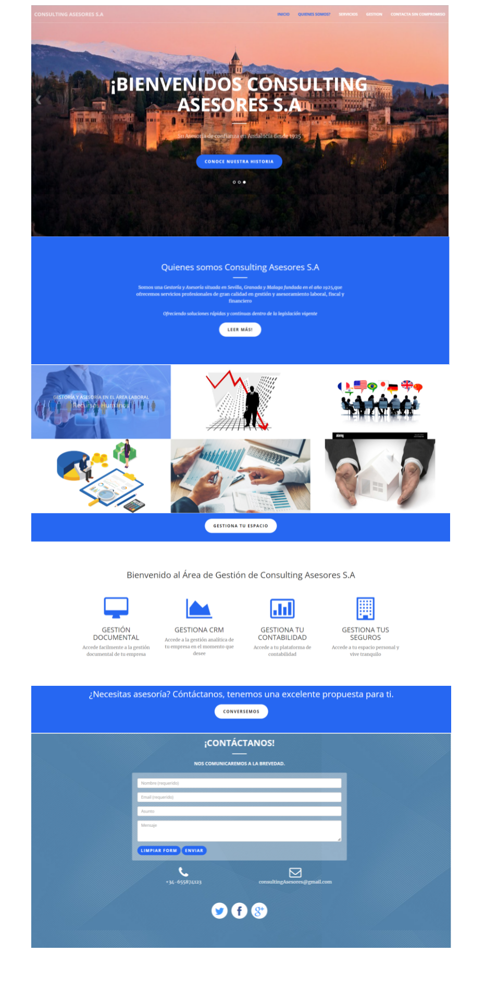

# REPOSITORIO PROYECTO ASESORÍA CONSULTING S.A

# Introducción:

La intención es realizar una página web de una consultoría que ses fácil y accesible para todos clientes.Y poder aplicar mis conocimientos de Administración de Empresas a y programación para que tenga una buena funcionalidad desde frontEnd y parte del BackEnd.

## BRAINSTORM

1. Web Asesoría-consultoría. "ELEGIDA"
2. Red Social: Permite a los usuarios interactuar entre ellos en diferentes ámbitos
3. Encuestas: Preguntar sobre diferentes temas y poder evaluar sus resultados. Muy útil para departamentos de Marketing.
4. Biblioteca: Pagina que permita ordenar/ prestar libros a los usuarios.
5. Blog de noticias: Información relacionada con diferentes temas de actualidad.
6. Enciclopedia: Almacenar el conocimiento humano, organizado alfabéticamente y descrito de manera objetiva.
7. Gestion de internos de vuelos:Organización interna de una compañía aerea p.e puerta embarque, billetes...
8. Recetario: Descripcion de diferentes recetas de cocina, ordenadas según las diferentes cocinas internacionales.
9. Blog de opinion: Poder dar tu opinión sobre diferentes temas de actualidad.
10. Mailing: Usuarios enviaran mails entre ellos

## Nombre del proyecto: ASESORÍA CONSULTING S.A.

## Descripción del proyecto:

`Crear una página web para una asesoría donde se ofrezcan servicios profesionales de gestión y asesoramiento legal en diferentes ámbitos como por ejemplo el área laboral, Fiscal, extranjería...`

## Mercado:

`Todo tipo de clientes particulares(mayores de edad o menor tutedalo) o empresas que necesiten asesoría sobre temas legales específicos `

## Lenguajes, codigos, bibliotecas y frameworks serán usados:

1. Html5
2. Css3
3. JavaScript
4. Php
5. Boostrap
6. FontsAwesome
7. Fonts
8. Jquery
9. MySQL- MariaDB

## Herramientas

```
 Utilización de  GitHUb para controlar las versiones mediante repositorios, se usara la web ``websur.tk``.
 Se usará una  una DB en internet para poder tener acceso a ella 365 días.
 Heroku  se utilizará parar tener un servidor de php.
Se mantendrán las  librerias actualizadas.

```

## Realizar un diagrama de Gantt


## Wireframes








## Path


## Mockup



## Casos de uso

- SignIn

- LoginIN

- Contacta con nosotros

##

1. SignIn

   `En este apartado los clientes van a poder darse de alta desde un formulario introduciendo información personal básica como Nombre, Apellidos, Dni, Email...`

2. LoginIN

   ` Una vez registrados los clientes van apoder acceder a su espacio personal mediante su nombre y su email`

3. Contacta con nosotros

   `En este apartado cualquier persona (cliente o no)podrá ponerse en contacto con la empresa y pedir información básica sobre temas legales introduciendo algunos datos personales básicos en un formulario de contacto`
