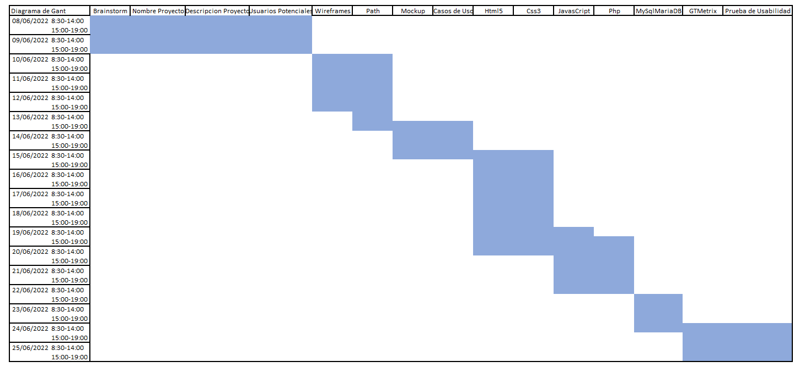
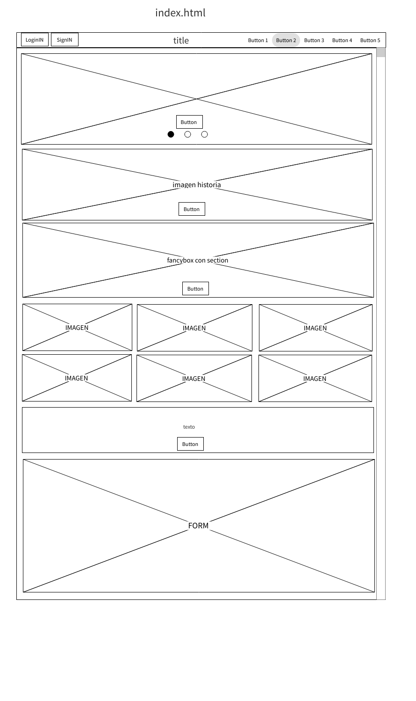
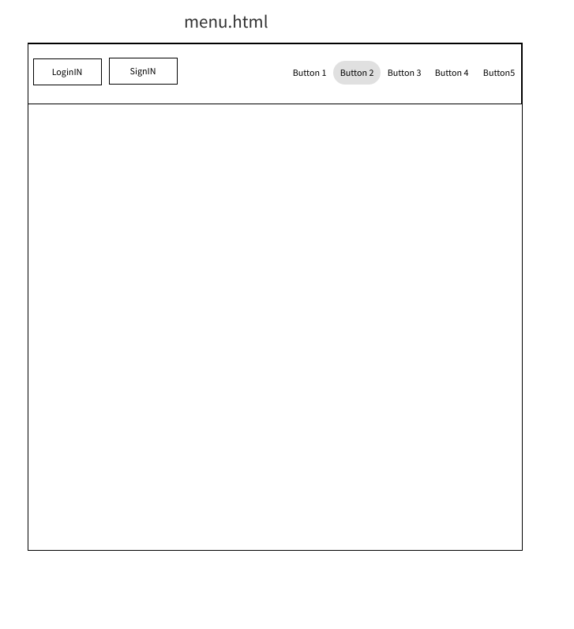
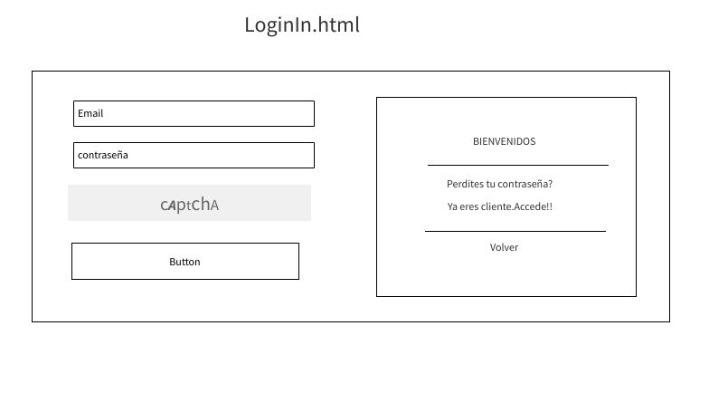
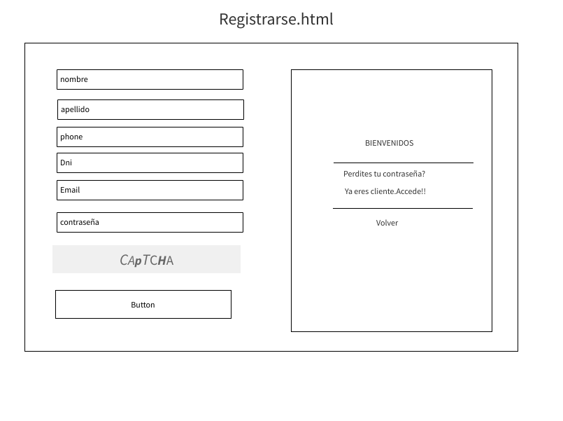
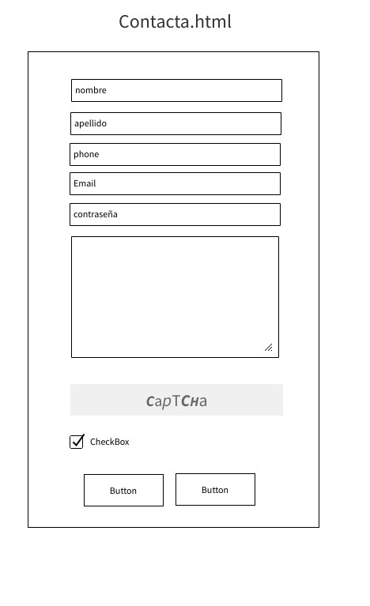
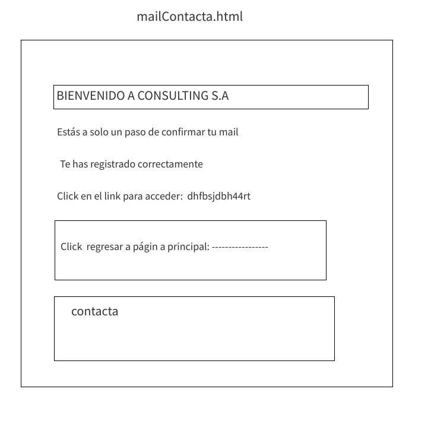
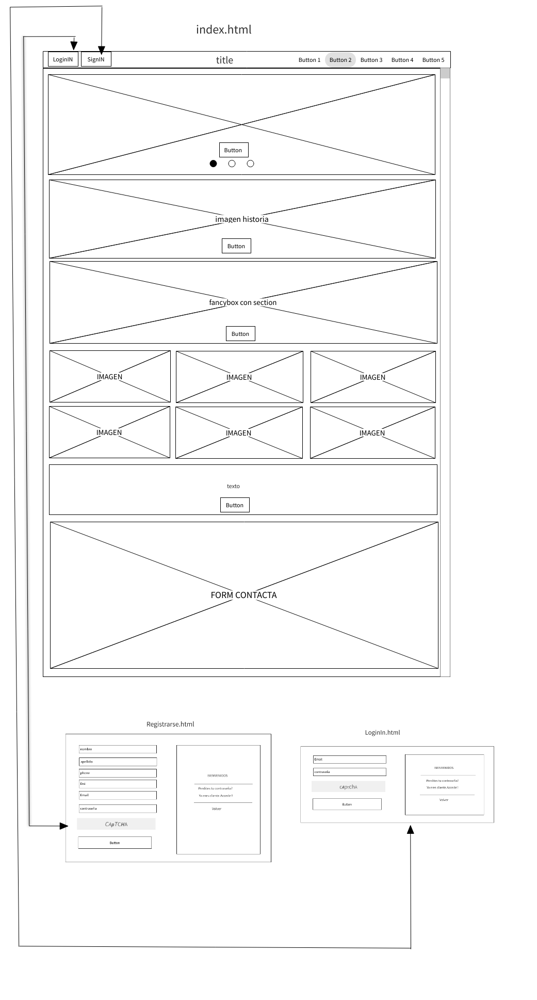
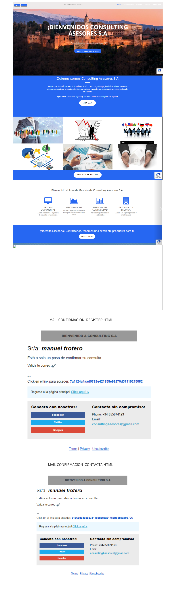

# Explicación previa:

La intención es realizar una página web de una consultoría que ses fácil y accesible para todos clientes.Y poder aplicar mis conocimientos de Administración de Empresas a y programación para que tenga una buena funcionalidad desde frontEnd y parte del BackEnd.

## BRAINSTORM

1. Web Asesoría-consultoría. "ELEGIDA"
2. Red Social: Permite a los usuarios interactuar entre ellos en diferentes ámbitos. " NO ELEGIDA porque no me pareció oportuno"
3. Encuestas: Preguntar sobre diferentes temas y poder evaluar sus resultados. Muy útil para departamentos de Marketing. " NO ELEGIDA aunque parezca de mi ámbito lo llevan empresas externas a asesorías"
4. Biblioteca: Pagina que permita ordenar/ prestar libros a los usuarios. " NO ELEGIDA porque es un tema que no me interesa"
5. Blog de noticias: Información relacionada con diferentes temas de actualidad. " NO ELEGIDA no me gustan los periódicos"
6. Enciclopedia: Almacenar el conocimiento humano, organizado alfabéticamente y descrito de manera objetiva. " NO ELEGIDA porque no me gusta"
7. Gestion de internos de vuelos:Organización interna de una compañía aerea p.e puerta embarque, billetes... " NO ELEGIDA por la complejidad del proyecto dentro mySQL"
8. Recetario: Descripcion de diferentes recetas de cocina, ordenadas según las diferentes cocinas internacionales. " NO ELEGIDA porque no le veo utilidad a un recetario"
9. Blog de opinion: Poder dar tu opinión sobre diferentes temas de actualidad. "NO ELEGIDA porque es un blog poco interensate"
10. Mailing: Usuarios enviaran mails entre ellos. " NO ELEGIDA aunque sea bastante valioso dentro de la página no hay tiempo material para hacerlo"

## Nombre del proyecto: ASESORÍA CONSULTING S.A.

## Descripción del proyecto:

`Crear una página web para una asesoría donde se ofrezcan servicios profesionales de gestión y asesoramiento legal en diferentes ámbitos como por ejemplo el área laboral, Fiscal, extranjería...`

## Descripción de las características

`Será una página web fácil e intuitiva donde el cliente pueda navegar`
`El cliente podrá comunicarse con el consultor, que tendrá la responsabilidad de asesorar a su cliente para que alcance sus objetivos`
`Los clientes podrán acceder a su espacio personal y gestionar su espacio personal `

## Mercado:

`Todo tipo de clientes particulares(mayores de edad o menor tutelados) o empresas que necesiten asesoría sobre temas legales `

## Lenguajes, codigos, bibliotecas y frameworks serán usados:

1. Lenguajes
   1. Html5
   2. Css3
   3. JavaScript
   4. Php
2. Bibliotecas
   1. Boostrap
   2. FontsAwesome
   3. Fonts
   4. Jquery
3. MySQL- MariaDB

## Herramientas

```
 Utilización de  GitHUb para el control de versiones mediante repositorios, contratando el dominio de la página web Freenom y se usará la web `websur.tk`.
 Se usará una  una base de datos MariaDB con código SQL y se contratará a myfreehosting.net  para poder tener acceso remoto.

Se utilizará Heroku parar tener un servidor de php donde se actualizará el código mediante repositorio.
```

## Realizar un diagrama de Gantt



## Wireframes














## Path



## Mockup



## Casos de uso

- SignIn

- LoginIN

- Contacta con nosotros

### Explicación de los casos de uso

1. SignIn

   `En este apartado los clientes van a poder darse de alta desde un formulario introduciendo información personal básica como Nombre, Apellidos, Dni, Email...`

2. LoginIN

   ` Una vez registrados los clientes van apoder acceder a su espacio personal mediante su nombre y su email`

3. Contacta con nosotros

   `En este apartado cualquier persona (cliente o no)podrá ponerse en contacto con la empresa y pedir información básica sobre temas legales introduciendo algunos datos personales básicos en un formulario de contacto`

## Diferencias entre proyecto inicial y Final

1. Ajuste de tiempo en HTML5 y CSS3, huboi que arreglar código y hubo que recortar de planteamiento inicial del proyecto.

2.  Se ajustan los tiempos en el diagrama de Gant, debido a que la parte extra de Php y Base de Datos SQL requirienron mas tiempo de lo estimado

3. Cambio en el formato final de los forms, se aclimatan unos forms que llaman más la atención y son más atraibles a la vista. Además se agregan enlaces para poder moverse entre registrarse, nuevo usuario e index.html.

4. Los mail de cofirmación tanto de registrarse como de contacto, se cambia sus formato paras ser más fáciles y entendibles para el cliente y contengas más información extra.
5. Los mails de registro y contacto se rellenan automaticamente al registrarte/ conatacto mediante los datos introducidos en el form y así el cliente puede guardar sus datos en caso de verificarlos.
