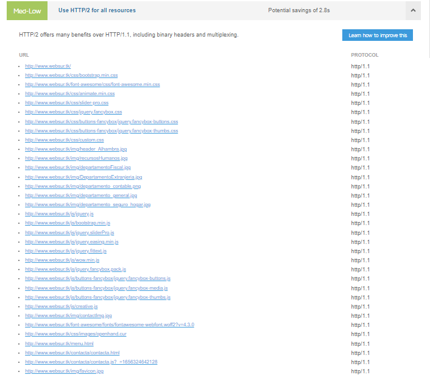

## Nombre del proyecto: ASESORÍA CONSULTING S.A.

## Descripción del proyecto:

`Crear una página web para una asesoría donde se ofrezcan servicios profesionales de gestión y asesoramiento legal en diferentes ámbitos como por ejemplo el área laboral, Fiscal, extranjería...`

## Descripción de las características

`Será una página web fácil e intuitiva donde el cliente pueda navegar`
`El cliente podrá comunicarse con el consultor, que tendrá la responsabilidad de asesorar a su cliente para que alcance sus objetivos`
`Los clientes podrán acceder a su espacio personal y gestionar su espacio personal `

## Mercado:

`Todo tipo de clientes particulares(mayores de edad o menor tutelados) o empresas que necesiten asesoría sobre temas legales `

## Lenguajes, codigos, bibliotecas y frameworks serán usados:

1. Lenguajes utilizados para programar

   - Html5
   - Css3
   - JavaScript
   - Php

2. Bibliotecas

   - [Boostrap] (https://getbootstrap.com/)
   - [FontsAwesome] (https://fontawesome.com/)
   - [Fonts](https://fonts.google.com/)
   - [Jquery](https://fonts.google.com/)
   - [Ajax](https://developer.mozilla.org/es/docs/Web/Guide/AJAX)
   - [composer](https://getcomposer.org/)

3. [MySQL- MariaDB](https://www.freemysqlhosting.net/register/?action=register)
4. [Recaptcha](https://www.google.com/recaptcha/about/)
5. [Heroku](https://www.heroku.com/)
6. PHPMailer

## Estructura 🔧

- [index.html](/index.html) Pagina Principal del proyecto
- [menu.html](/menu.html)Menu asociado a la página principal
- [login.html](/registerFinal/login.html)Página nueva para usuarios registrado.
- [registrarse.html](/registerFinal/registrarse.html) Página para darse de alta como nuevo usuario.
- [contacta.html](/contacta/contacta.html) Formulario en la página principal para contacto.
- `MailContacta.html` Mail de confirmación al contactar.
- `MailRegistro.html` Mail de confirmación al registrarte.

## Herramientas

Uso de Utilización de GitHUb para el control de versiones mediante repositorios, y en este caso contratando el dominio de la página web Freenom, se usará la web `websur.tk`. Solo servirá como prueba de visualización Html-Css-Js.

Se utilizará heroku como servidor Php y mantener actualizado las versiones de GitHub, no he podido añadir websur.tk a heroku porque era de pago.

Uso de [composer](https://getcomposer.org/) para mantener actualizadas las librerías

Se usará una una base de datos MariaDB con código SQL y se contratará a myfreehosting.net para poder tener acceso remoto.Adjuntadose la DataBase a el archivo sql4501016.sql

Uso de Recaptcha de google para la verificación del registros para nuevos clientes, para el inicio de sesión y para formulario de contacto si fuera necesario.

## Realizar un diagrama de Gantt

## Wireframes

## Path

## Mockup

## Casos de uso

- SignIn

- LoginIN

- Contacta con nosotros

### Explicación de los casos de uso

1. SignIn

   `En este apartado los clientes van a poder darse de alta desde un formulario introduciendo información personal básica como Nombre, Apellidos, Dni, Email...`

2. LoginIN

   ` Una vez registrados los clientes van apoder acceder a su espacio personal mediante su nombre y su email`

3. Contacta con nosotros

   `En este apartado cualquier persona (cliente o no)podrá ponerse en contacto con la empresa y pedir información básica sobre temas legales introduciendo algunos datos personales básicos en un formulario de contacto`

## Diferencias entre proyecto inicial y Final

1. Ajuste de tiempo en HTML5 y CSS3, hubo que arreglar código y hubo que variar parte del planteamiento inicial del proyecto.

2. Se ajustan los tiempos en el diagrama de Gant, debido a que la parte extra de Php y Base de Datos SQL requirieron mas tiempo de lo estimado.

3. Cambio en el formato final de los forms, se aclimatan unos forms que llaman más la atención y son más atraibles a la vista. Además se agregan enlaces para poder moverse entre ambos forms y poner regresar a la página inicio.

4. Los mail de cofirmación tanto de registrarse como de contacto, se cambia sus formato para ser más fáciles y entendibles para el cliente y contienen más información extra.Además de redirigirte a la página inicial, Facebook, Instagram,y google. Y se añaden enlances terminos y condiciones.

5. Los mails de registro y contacto se rellenan automaticamente al registrarte o contactar mediante los datos introducidos en el form y así el cliente puede guardar sus datos en caso de que querer verificarlos o cambiarlos.

6. El formulario de registro durante su primer mail se queda en la DB de SQL usuarios_temp para poder enviar más de uno en caso de error y en el momento de rebibir el mail y clicar en link se elimina automaticamente del usuarios_temps todos los mails con identico usuario y pasa únicamente como registrado a la tabla usuario para poder acceder a su espacio personal y evitar así duplicidades de mails.

7. El formulario de contacto en su primer mail esta en estado 0 y cambia al estado 1 en la Db de SQL al presionar en el link que se recibe en la cuenta de correo personal.

## Prueba Usabilidad

`resultado obtenido mediante GTMETRIX`

